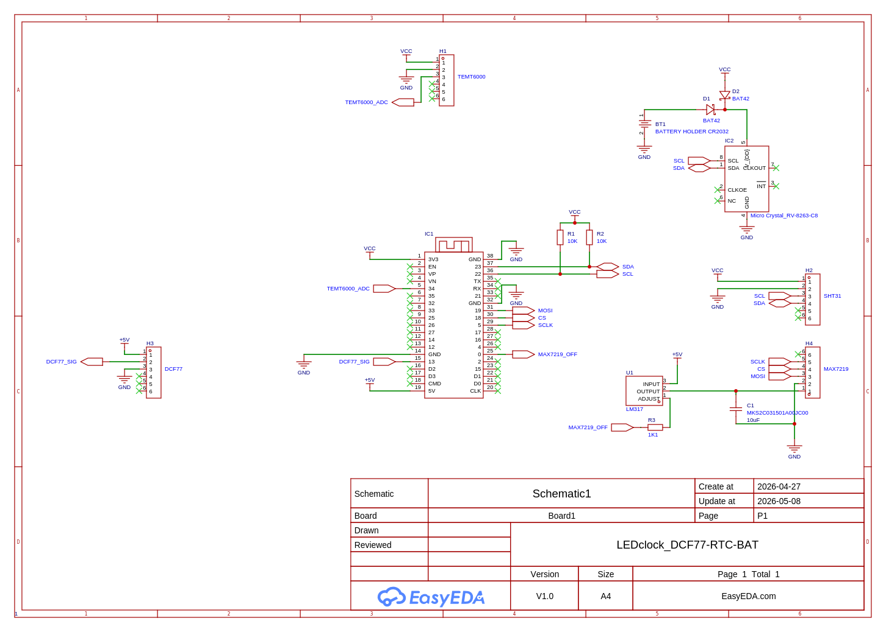
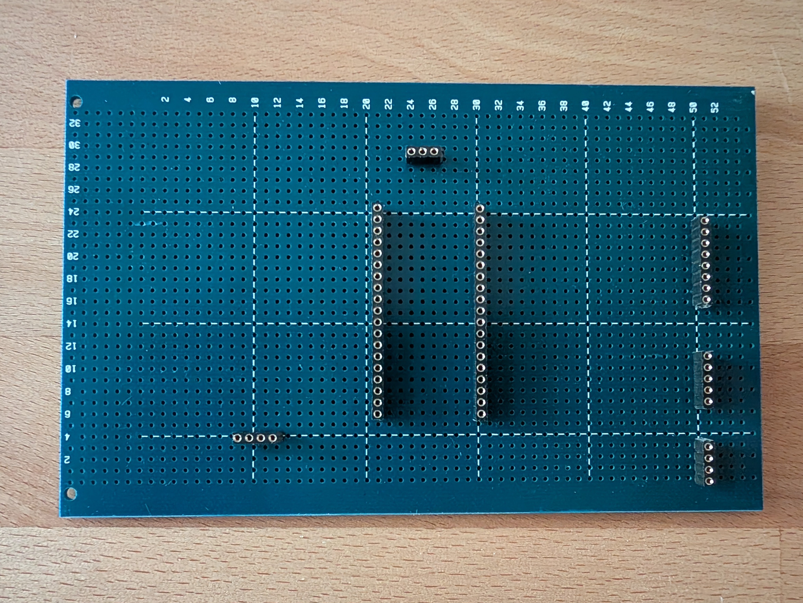
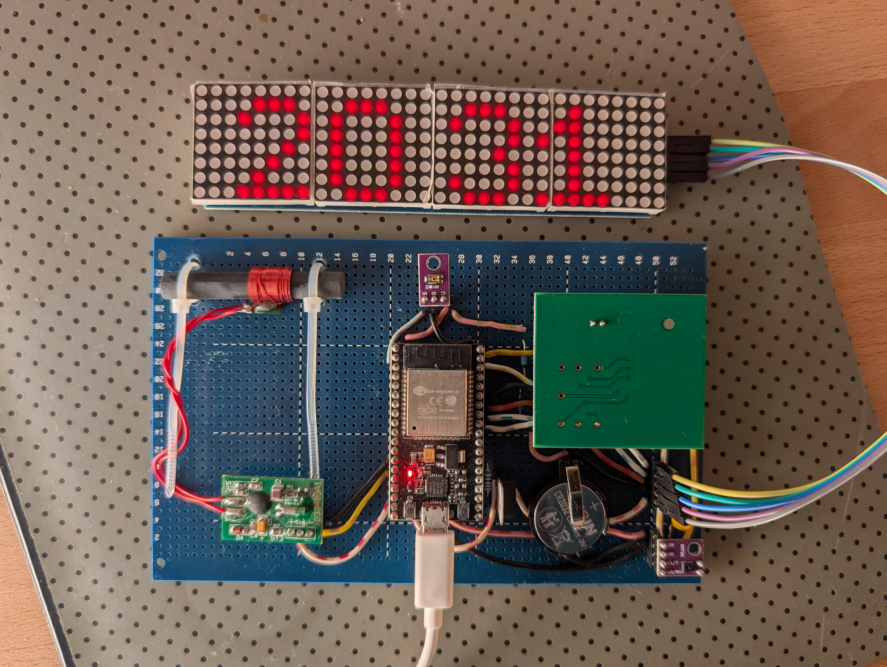
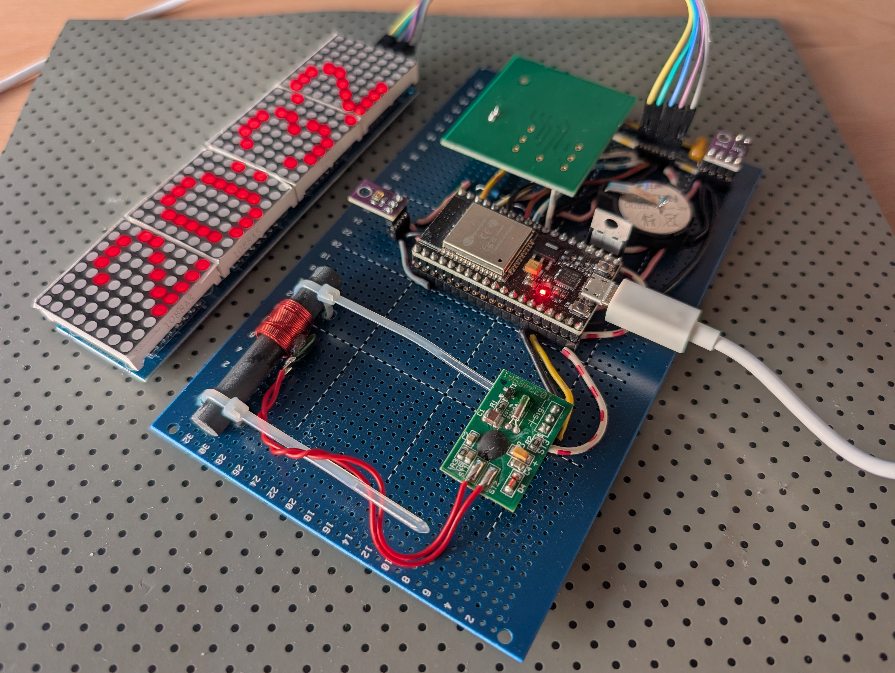

# LEDclock_DCF77-RTC_MicroPythonESP

Batterie-Backup für RV-8263 RTC
-------------------------------

    ESP-WROOM-32 NodeMCU

    VCC (3.3V ESP) -----------------+-------+-------+
                                    |       |       |
                                    [R1]    [R2]    [D1] (Schottky)
                                    10k     10k     |
                                    |       |       |
    SDA (GPIO 23) ------------------+----------------------- SDA (RV-8263)
                                            |       |
    SCL (GPIO 22) --------------------------+--------------- SCL (RV-8263)
                                                    |
                                                    +------- VCC (RV-8263)
                                                    |
    Batterie (+) ----------[D2] (Schottky) ---------+
    (Knopfzelle)

    GND (ESP) --------------------------------------+------- VSS (RV-8263)
                                                    |
    Batterie (-) -----------------------------------+

* R1 = R2: 10 kOhm
* D1 = D2: Schottky-Diode BAT 42/43 oder BAT 86

Schaltbild Peripherie (ohne Backup-Batterie)
--------------------------------------------

    ESP-WROOM-32 NodeMCU

    3V3  -----------------------------------+------------------+------------------+
                                            |                  |                  |
                                            |                  |                  +---- VCC (MAX7219)
                                            |                  +----------------------- VCC (TEMT6000)
                                            +------------------------------------------ VCC (I2C: RV-8263, SHT31)

    5V (VIN) --------------------------------------------------- VCC (DCF77)

    GND  -----------------------------------+------------------+------------------+------------------+
                                            |                  |                  |                  |
                                            |                  |                  |                  +---- GND (MAX7219)
                                            |                  |                  +---- GND (DCF77)
                                            |                  +----------------------- GND (TEMT6000)
                                            +------------------------------------------ VSS (I2C: RV-8263, SHT31)

    GPIO23 (SDA) ---------------------------+------------------ SDA (RV-8263)
                                            |
                                            +------------------ SDA (SHT31)

    GPIO22 (SCL) ---------------------------+------------------ SCL (RV-8263)
                                            |
                                            +------------------ SCL (SHT31)

    GPIO36 (ADC) ------------------------------------------------ AO/OUT (TEMT6000)

    GPIO13 -------------------------------------------------------- DATA/OUT (DCF77)

    GPIO19 (SPI MOSI) ------------------------------------------------ DIN (MAX7219)

    GPIO18 (SPI CS) -------------------------------------------------- CS (MAX7219)

    GPIO5  (SPI SCLK) ------------------------------------------------ SCLK (MAX7219)

Pinbelegung im Code
-------------------

- I2C SDA: GPIO23
- I2C SCL: GPIO22
- TEMT6000 ADC: GPIO34
- DCF77 Signal: GPIO13
- MAX7219 DIN (MOSI): GPIO19
- MAX7219 CS: GPIO18
- MAX7219 CLK (SCLK): GPIO5
- MAX7219 Power ON/OFF: GPIO0

Hinweis DCF77 Versorgung
------------------------

- DCF77 darf hier mit 5V versorgt werden (wie von dir gewuenscht).
- Wichtig: Das DCF77-Datensignal muss auf 3.3V-Pegel zum ESP32 angepasst werden (Spannungsteiler, Pegelwandler oder Open-Collector mit 3.3V Pull-up).
- Fuer Signalqualitaet kann 5V beim DCF-Empfaenger etwas robuster sein.
- Wenn dein Modul sauber mit 3.3V laeuft, ist das oft die einfachste und sicherste Loesung, weil dann meist kein Pegelwandler noetig ist.

ASCII-Boardplan DIN-Lochraster 32x54 (einseitig)
-------------------------------------------------

Schienen horizontal, Signale vertikal mit Drahtbruecken.

        +----------------------------------------------------+
    01  |5V==================================================|
        |....................................................|
        |3V3=================================================|
        |....................................................|
    05  |GND=================================================|
        |....................................................|
        |SDA=================================================|
        |SCL=================================================|
        |....................................................|
    10  |...................ESP32 NodeMCU....................|
        |   L01 3V3    o......................o GND    R01   |
        |   L02 RESET  o......................o GPIO23 R02   |
        |   L03 GPIO36 o......................o GPIO22 R03   |
        |   L04 GPIO39 o......................o INT    R04   |
    15  |   L05 GPIO34 o......................o INT    R05   |
        |   L06 GPIO35 o......................o GPIO21 R06   |
        |   L07 GPIO32 o......................o GND    R07   |
        |   L08 GPIO33 o......................o GPIO19 R08   |
        |   L09 GPIO25 o......................o GPIO18 R09   |
    20  |   L10 GPIO26 o......................o GPIO5  R10   |
        |   L11 GPIO27 o......................o GPIO17 R11   |
        |   L12 GPIO14 o......................o GPIO16 R12   |
        |   L13 GPIO12 o......................o GPIO4  R13   |
        |   L14 GND    o......................o GPIO0  R14   |
    25  |   L15 GPIO13 o......................o GPIO2  R15   |
        |   L16 INT    o......................o GPIO15 R16   |
        |   L17 INT    o......................o INT    R17   |
        |   L18 INT    o......................o INT    R18   |
        |   L19 5V     o......................o INT    R19   |
    30  |....................................................|
        |....................................................|
        |....................................................|
        +----------------------------------------------------+

Pinouts
-------

### RV-8263
* NC
* Vss
* NC (CLKOE)
* NC (INT)
* VDD
* NC (CLKOUT)
* SCL
* SDA

### SHT31
* VING
* GND
* SCL
* SDA

### TEMT6000
* OUT
* GND
* VCC

### DCF77
* VIN
* SIG
* GND

### MAX7219
* VCC
* GND
* DIN
* CS
* CLK

Lochrasterplatinenlayout
------------------------

