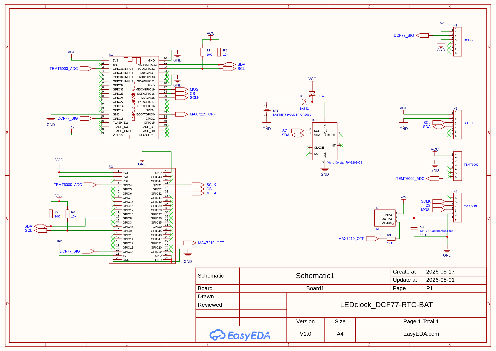
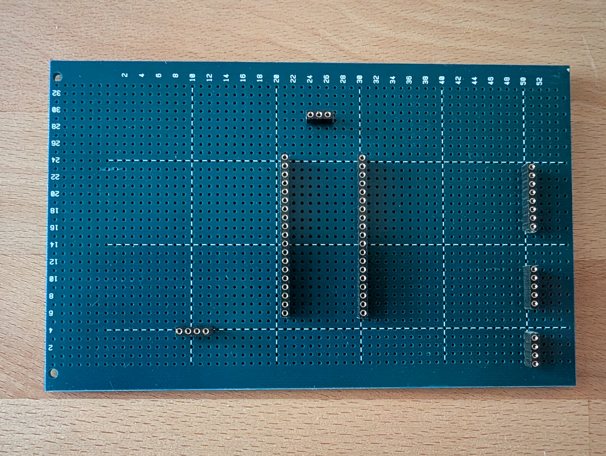
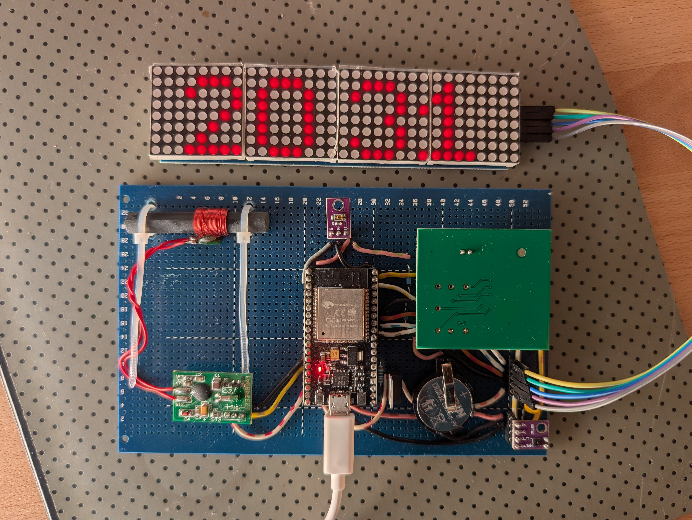
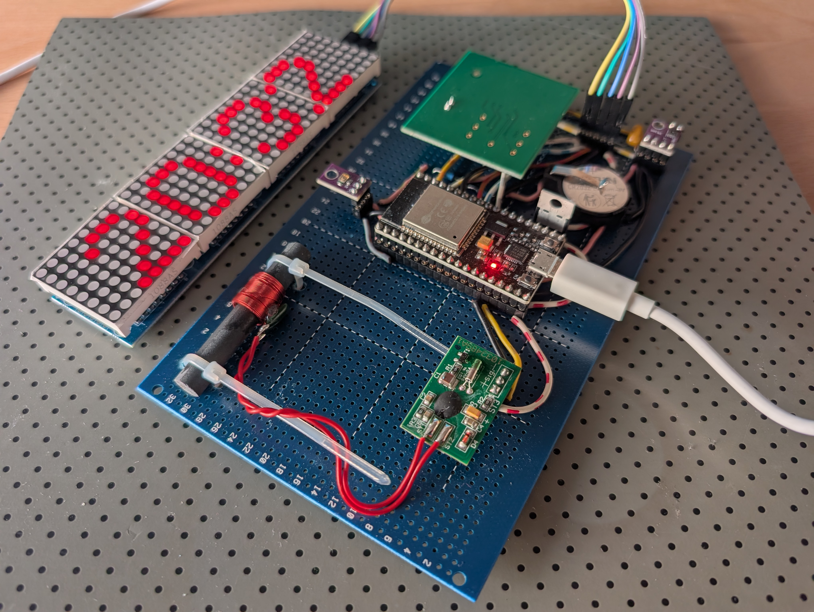

# LEDclock_DCF77-RTC_MicroPythonESP

MicroPython-LED-Uhr auf MAX7219-Punktmatrix-Modulen mit DCF77-Zeitzeichenempfänger,
batteriegepufferter externer RTC (RV-8263), Temperatur-/Luftfeuchtesensor (SHT31)
und Helligkeitssensor (TEMT6000) zur automatischen Display-Dimmung.

Es gibt zwei Hardware-Varianten mit identischer Software:

* **Board 1: ESP-WROOM-32** (NodeMCU)
* **Board 2: ESP32-S3-WROOM-1** (N16R8)

Boardvarianten & Pinbelegung
----------------------------

Die Pinbelegung liegt nicht mehr im Code, sondern in JSON-Dateien in `src/`:

* `board_esp-wroom-32.json` — Board 1
* `board_esp32-s3-wroom-1.json` — Board 2

Das Modul `src/boardconfig.py` erkennt das Board zur Laufzeit automatisch
(über `os.uname().machine`) und lädt die passende Datei. Es genügt also, beide
JSON-Dateien mit auf das Gerät zu kopieren. Für Sonderaufbauten kann eine Datei
`board.json` auf dem Gerät abgelegt werden, die dann Vorrang hat.

| Funktion / Peripherie | Signal      | ESP-WROOM-32 | ESP32-S3-WROOM-1 | Anmerkung |
| :-------------------- | :---------- | :----------- | :--------------- | :-------- |
| I2C (RV-8263, SHT31)  | SDA         | GPIO23       | GPIO8            | 50 kHz, interne Pull-ups |
|                       | SCL         | GPIO22       | GPIO9            | |
| TEMT6000              | ADC         | GPIO36 (ADC1_CH0) | GPIO4 (ADC1_CH3) | zwingend ADC1 (ADC2 kollidiert mit Wi-Fi) |
| DCF77                 | DATA        | GPIO13       | GPIO14           | Eingang mit Pull-up |
| MAX7219               | DIN (MOSI)  | GPIO19       | GPIO42           | S3: GPIO19/20 sind USB! |
|                       | SCLK        | GPIO5        | GPIO1            | |
|                       | CS          | GPIO18       | GPIO2            | |
| MAX7219 Power ON/OFF  | GPIO out    | –            | GPIO21           | optional (`null` in JSON = nicht beschaltet) |
| Status-LED            | GPIO out    | GPIO2        | –                | S3-DevKit hat nur RGB-LED (GPIO48) |

Wichtige Hinweise zum ESP32-S3 (Details in `hardware/Pinout Proposal.md`):

* **GPIO19/20** sind das native USB-Interface — nicht extern beschalten.
* **GPIO0** ist Strapping-Pin (Bootloader) — nicht als Power-Control verwenden.
* **N16R8 (8 MB Octal-PSRAM):** GPIO33–37 sind intern belegt; die herausgeführten
  GPIO35–37 dürfen **nicht** beschaltet werden.

Batterie-Backup für RV-8263 RTC
-------------------------------

Anschlüsse am Beispiel ESP-WROOM-32 (beim ESP32-S3: SDA = GPIO8, SCL = GPIO9):

    ESP-WROOM-32 NodeMCU

    VCC (3.3V ESP) -----------------+-------+-------+
                                    |       |       |
                                    [R1]    [R2]    [D1] (Schottky)
                                    10k     10k     |
                                    |       |       |
    SDA (GPIO 23) ------------------+----------------------- SDA (RV-8263)
                                            |       |
    SCL (GPIO 22) --------------------------+--------------- SCL (RV-8263)
                                                    |
                                                    +------- VCC (RV-8263)
                                                    |
    Batterie (+) ----------[D2] (Schottky) ---------+
    (Knopfzelle)

    GND (ESP) --------------------------------------+------- VSS (RV-8263)
                                                    |
    Batterie (-) -----------------------------------+

* R1 = R2: 10 kOhm
* D1 = D2: Schottky-Diode BAT 42/43 oder BAT 86

Schaltbild Peripherie (ohne Backup-Batterie)
--------------------------------------------

Verdrahtungspläne für beide Boards liegen in `hardware/`:

* [Wiring Diagram ESP-WROOM-32](./hardware/Wiring%20Diagram_ESP-WROOM-32.png) ([PDF](./hardware/Wiring%20Diagram_ESP-WROOM-32.pdf))
* [Wiring Diagram ESP32-S3-WROOM-1](./hardware/Wiring%20Diagram_ESP32-S3-WROOM-1.png) ([PDF](./hardware/Wiring%20Diagram_ESP32-S3-WROOM-1.pdf))

ASCII-Übersicht am Beispiel ESP-WROOM-32:

    ESP-WROOM-32 NodeMCU

    3V3  -----------------------------------+------------------+------------------+
                                            |                  |                  |
                                            |                  |                  +---- VCC (MAX7219)
                                            |                  +----------------------- VCC (TEMT6000)
                                            +------------------------------------------ VCC (I2C: RV-8263, SHT31)

    5V (VIN) --------------------------------------------------- VCC (DCF77)

    GND  -----------------------------------+------------------+------------------+------------------+
                                            |                  |                  |                  |
                                            |                  |                  |                  +---- GND (MAX7219)
                                            |                  |                  +---- GND (DCF77)
                                            |                  +----------------------- GND (TEMT6000)
                                            +------------------------------------------ VSS (I2C: RV-8263, SHT31)

    GPIO23 (SDA) ---------------------------+------------------ SDA (RV-8263)
                                            |
                                            +------------------ SDA (SHT31)

    GPIO22 (SCL) ---------------------------+------------------ SCL (RV-8263)
                                            |
                                            +------------------ SCL (SHT31)

    GPIO36 (ADC) ------------------------------------------------ AO/OUT (TEMT6000)

    GPIO13 -------------------------------------------------------- DATA/OUT (DCF77)

    GPIO19 (SPI MOSI) ------------------------------------------------ DIN (MAX7219)

    GPIO18 (SPI CS) -------------------------------------------------- CS (MAX7219)

    GPIO5  (SPI SCLK) ------------------------------------------------ SCLK (MAX7219)

Hinweis DCF77 Versorgung
------------------------

- Der DCF77-Empfänger kann mit 5V versorgt werden; das ist für die Signalqualität
  oft etwas robuster.
- Wichtig: Das DCF77-Datensignal muss dann auf 3.3V-Pegel zum ESP32 angepasst
  werden (Spannungsteiler, Pegelwandler oder Open-Collector mit 3.3V Pull-up).
- Läuft das Modul sauber mit 3.3V, ist das meist die einfachste und sicherste
  Lösung, weil kein Pegelwandler nötig ist.
- DCF77-Empfänger reagieren empfindlich auf Wi-Fi-Störungen und sollten räumlich
  getrennt vom ESP32 platziert werden.

Software
--------

Die Skripte liegen in `src/`:

* `main.py` — Hauptprogramm (asyncio-Tasks: DCF77-Empfang, Zeit-Sync, Sensorik, Anzeige)
* `boardconfig.py` — lädt die Pinbelegung aus `board_*.json` (Auto-Erkennung)
* `dcf77.py` — DCF77-Dekoder
* `rv8263.py` — Treiber externe RTC RV-8263
* `sht31.py` — Treiber Temperatur-/Feuchtesensor SHT31
* `temt6000.py` — Treiber Helligkeitssensor TEMT6000
* `max7219wrapper.py`, `characters.py` — Display-Ansteuerung und Fonts
* `lib/max7219.py` — MAX7219-Basistreiber (mcauser), auf dem Gerät nach `/lib`
* `playground/` — Diagnose-Skripte (DCF77-Analyzer, I2C-Diagnose)

Deployment z.B. mit `mpremote`: alle `.py` aus `src/` sowie **beide**
`board_*.json` ins Wurzelverzeichnis des Geräts kopieren, `src/lib/max7219.py`
nach `/lib/max7219.py`.

Entwicklung: Linting & Typechecking
-----------------------------------

### Einrichtung der venv

Die Konfigurationen (`pyrightconfig.json`, `scripts/update-typeshed.sh`) erwarten
die venv unter `.venv` mit **Python 3.11**. Einrichtung wahlweise mit pip oder uv:

    ## Variante A: pip/venv
    python3.11 -m venv .venv
    .venv/bin/pip install -r requirements.txt

    ## Variante B: uv
    uv venv --python 3.11 .venv
    uv pip install -r requirements.txt

    ## Danach in beiden Fällen: kombiniertes Typeshed für ty erzeugen
    ./scripts/update-typeshed.sh

`requirements.txt` enthält alles Nötige:

* `micropython-esp32-stubs` — Typ-Stubs für `machine`, `network`, `time.ticks_ms()`
  usw. (zieht `micropython-stdlib-stubs` automatisch mit)
* `basedpyright` — Typechecker, gleiche Engine wie Pylance
* `ty` — Typechecker von Astral (Hersteller von ruff/uv)
* `ruff` — Linter (Import-Sortierung, Code-Stil, Komplexität)

*(Hinweis: Das npm-Paket `pyright` selbst braucht eine Node-Runtime mit
`libatomic.so.1` — `basedpyright` bringt dagegen alles als Python-Wheel mit
und liest dieselbe `pyrightconfig.json`.)*

### Checker ausführen

    .venv/bin/basedpyright src    ## Konfiguration: pyrightconfig.json
    .venv/bin/ty check            ## Konfiguration: pyproject.toml [tool.ty]
    .venv/bin/ruff check src      ## Linter, Konfiguration: pyproject.toml [tool.ruff]

Alle drei müssen fehlerfrei durchlaufen (Stand der letzten Bereinigung:
0 Fehler / "All checks passed").

### Wie die Stub-Auflösung funktioniert (wichtig bei Problemen)

Die MicroPython-Stubs liegen nach der Installation **flach** in den
site-packages (`time.pyi`, `machine.pyi`, ...), zusätzlich liefert
`micropython-stdlib-stubs` ein partielles `stdlib/`-Verzeichnis (u.a. `asyncio`
mit `sleep_ms`). Die beiden Checker finden sie unterschiedlich:

* **basedpyright/Pylance:** über `stubPath` **und** `typeshedPath` in
  `pyrightconfig.json` — beide zeigen auf
  `.venv/lib/python3.11/site-packages`. Bei einem Wechsel der Python-Version
  müssen diese Pfade angepasst werden!
* **ty:** kennt keinen `stubPath`, sondern nur ein komplettes Ersatz-Typeshed
  (`[tool.ty.environment].typeshed = ".typeshed"` in `pyproject.toml`).
  `scripts/update-typeshed.sh` baut dieses Verzeichnis aus den installierten
  Stubs zusammen (stdlib-Stubs + das dort fehlende `time.pyi`).
  **Nach jedem Update der Stubs erneut ausführen:**

      .venv/bin/pip install -U micropython-esp32-stubs   ## bzw. uv pip install -U ...
      ./scripts/update-typeshed.sh

### Bekannte Stolperfallen (ty 0.0.65)

* Das generierte Typeshed darf **nicht** `typings/` heißen (implizites
  Stub-Verzeichnis von ty → Absturz "dependency graph cycle"). Deshalb `.typeshed/`.
* `src` nicht zusätzlich in `[tool.ty.environment].extra-paths` eintragen —
  es ist bereits First-Party-Root, die Doppelung führt ebenfalls zum Absturz.
* ty versteht mypy-Fehlercodes nicht: `# type: ignore[operator]` unterdrückt
  nur Pylance/basedpyright. Für ty muss zusätzlich `# ty: ignore[<regel>]` an
  die Zeile (Beispiele in `main.py` bei der Driftkompensation).
* Ticks sind in den Stubs bewusst opak typisiert (`_TicksMs`): direkte
  Arithmetik wie `ticks_ms() % 1000` wird angemeckert — gewollt ist
  `time.ticks_diff()` / `time.ticks_add()`.

### VSCode

Empfohlene Extensions: **Pylance** (oder basedpyright) und **ty**. Damit die
Extensions die Checker aus der venv verwenden, stehen in der Workspace-Datei
(`*.code-workspace` ist gitignored, ggf. neu anlegen):

    "settings": {
        "python.defaultInterpreterPath": "${workspaceFolder}/.venv/bin/python",
        "ty.importStrategy": "fromEnvironment",
        "basedpyright.importStrategy": "fromEnvironment"
    }

ASCII-Boardplan DIN-Lochraster 32x54 (einseitig, ESP-WROOM-32)
--------------------------------------------------------------

Schienen horizontal, Signale vertikal mit Drahtbruecken.

        +----------------------------------------------------+
    01  |5V==================================================|
        |....................................................|
        |3V3=================================================|
        |....................................................|
    05  |GND=================================================|
        |....................................................|
        |SDA=================================================|
        |SCL=================================================|
        |....................................................|
    10  |...................ESP32 NodeMCU....................|
        |   L01 3V3    o......................o GND    R01   |
        |   L02 RESET  o......................o GPIO23 R02   |
        |   L03 GPIO36 o......................o GPIO22 R03   |
        |   L04 GPIO39 o......................o INT    R04   |
    15  |   L05 GPIO34 o......................o INT    R05   |
        |   L06 GPIO35 o......................o GPIO21 R06   |
        |   L07 GPIO32 o......................o GND    R07   |
        |   L08 GPIO33 o......................o GPIO19 R08   |
        |   L09 GPIO25 o......................o GPIO18 R09   |
    20  |   L10 GPIO26 o......................o GPIO5  R10   |
        |   L11 GPIO27 o......................o GPIO17 R11   |
        |   L12 GPIO14 o......................o GPIO16 R12   |
        |   L13 GPIO12 o......................o GPIO4  R13   |
        |   L14 GND    o......................o GPIO0  R14   |
    25  |   L15 GPIO13 o......................o GPIO2  R15   |
        |   L16 INT    o......................o GPIO15 R16   |
        |   L17 INT    o......................o INT    R17   |
        |   L18 INT    o......................o INT    R18   |
        |   L19 5V     o......................o INT    R19   |
    30  |....................................................|
        |....................................................|
        |....................................................|
        +----------------------------------------------------+

Pinouts
-------

### RV-8263
* NC
* Vss
* NC (CLKOE)
* NC (INT)
* VDD
* NC (CLKOUT)
* SCL
* SDA

### SHT31
* VING
* GND
* SCL
* SDA

### TEMT6000
* OUT
* GND
* VCC

### DCF77
* VIN
* SIG
* GND

### MAX7219
* VCC
* GND
* DIN
* CS
* CLK

Lochrasterplatinenlayout
------------------------

